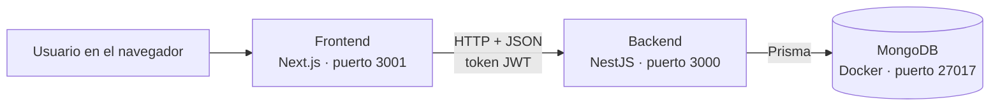

# Habit Tracker

Aplicación web para crear, seguir y analizar hábitos personales. Permite registrar hábitos con su frecuencia, prioridad y categoría, marcarlos como completados cada día y ver el progreso con rachas, estadísticas, gráficas y logros.

Proyecto individual. El repositorio tiene dos aplicaciones separadas: un **backend** (API REST) y un **frontend** (interfaz web).

## Funcionalidades

- **Cuenta de usuario:** registro, inicio y cierre de sesión con JWT. Las rutas de la app están protegidas.
- **Gestión de hábitos:** crear, editar, eliminar, activar y desactivar hábitos. Cada hábito tiene nombre, descripción, categoría, frecuencia (diaria, semanal o personalizada), prioridad, fecha de inicio y fecha de fin opcional. La lista se puede buscar, filtrar por estado y categoría y ordenar.
- **Seguimiento:** marcar hábitos como completados y revisar el historial en vista diaria, semanal y mensual.
- **Dashboard:** hábitos activos, completados hoy, racha actual, mejor racha, porcentaje de cumplimiento y gráficas semanal y mensual.
- **Estadísticas:** total de hábitos, activos, finalizados, racha actual, progreso de los últimos 30 días, tendencia semanal y el avance de cada hábito en los últimos 7 días.
- **Perfil:** datos del usuario, edición del nombre, actividad personal y logros desbloqueables.
- **Validaciones y errores:** formularios validados en el frontend (Zod) y en el backend (class-validator), con mensajes claros para el usuario.

## Tecnologías

| Parte | Tecnología |
| --- | --- |
| Backend | NestJS 12, TypeScript |
| Base de datos | MongoDB (en Docker) con Prisma ORM 6 |
| Autenticación | JWT con Passport, contraseñas cifradas con bcrypt |
| Validación del backend | class-validator y class-transformer |
| Documentación de la API | Swagger (OpenAPI) |
| Pruebas | Jest |
| Frontend | Next.js 16 (App Router), React 19, TypeScript |
| Interfaz | Material UI 9 y MUI X Charts |
| Validación del frontend | Zod |

## Arquitectura

La aplicación está separada en frontend y backend. El frontend no se conecta a la base de datos: todo pasa por la API.



### Backend

Sigue la estructura modular de NestJS. Cada módulo tiene su controlador (rutas), su servicio (lógica) y sus DTO (validación de datos de entrada).

| Módulo | Responsabilidad |
| --- | --- |
| `auth` | Registro, inicio de sesión, emisión y validación del token JWT (vigencia de 7 días) |
| `users` | Consultar y editar el perfil del usuario autenticado |
| `habits` | CRUD de hábitos, activar/desactivar y registrar completados |
| `statistics` | Resumen, rachas, actividad, tendencia semanal y seguimiento por hábito |
| `prisma` | Conexión compartida a la base de datos |
| `config` | Validación de las variables de entorno al arrancar |

Todas las rutas, excepto registro e inicio de sesión, requieren el token JWT. Cada usuario solo puede ver y modificar sus propios hábitos.

### Modelo de datos

| Colección | Campos principales |
| --- | --- |
| `Usuario` | nombre, correo (único), contraseña cifrada, fecha de registro |
| `Habito` | nombre, descripción, categoría, frecuencia, prioridad, fecha de inicio, fecha de fin, activo, usuario |
| `Registro` | hábito, usuario, fecha, completado |

Un usuario tiene muchos hábitos, y cada hábito tiene un registro por cada día en que se completó.

### Frontend

Usa el App Router de Next.js. Las páginas de la app viven dentro de `src/app/(app)`, que comparte la barra superior, el menú lateral y la protección de sesión.

| Carpeta | Contenido |
| --- | --- |
| `src/app/login`, `src/app/register` | Inicio de sesión y registro |
| `src/app/(app)/dashboard` | Dashboard |
| `src/app/(app)/habitos` | Mis hábitos |
| `src/app/(app)/seguimiento` | Seguimiento diario, semanal y mensual |
| `src/app/(app)/estadisticas` | Estadísticas |
| `src/app/(app)/perfil` | Perfil |
| `src/components` | Componentes reutilizables (navegación, formularios, vistas de seguimiento, logros) |
| `src/lib` | Cliente de la API, esquemas de validación, tema de colores, sesión y utilidades de fechas |

## Requisitos

- [Node.js](https://nodejs.org) 20.9 o superior
- [Docker Desktop](https://www.docker.com/products/docker-desktop/)
- Git

## Instalación y ejecución

### 1. Clonar el repositorio

```bash
git clone https://github.com/Fhernandez20/ProyectoUx.git
cd ProyectoUx
```

### 2. Levantar MongoDB con Docker

En Docker Desktop, descarga la imagen oficial `mongo` y crea un contenedor con esta configuración:

| Opción | Valor |
| --- | --- |
| Nombre del contenedor | `nestjs-mongodb` |
| Puerto | `27017` → `27017` |
| `MONGO_INITDB_ROOT_USERNAME` | `admin` |
| `MONGO_INITDB_ROOT_PASSWORD` | `123456` |

O, desde la terminal, con un solo comando:

```bash
docker run -d --name nestjs-mongodb -p 27017:27017 -e MONGO_INITDB_ROOT_USERNAME=admin -e MONGO_INITDB_ROOT_PASSWORD=123456 mongo
```

El contenedor debe aparecer como **Running** en Docker Desktop.

### 3. Configurar y arrancar el backend

```bash
cd habit-tracker-backend
npm install
```

Copia `.env.example` como `.env`:

```bash
cp .env.example .env
```

En Windows (PowerShell) el comando equivalente es `Copy-Item .env.example .env`.

| Variable | Descripción |
| --- | --- |
| `DATABASE_URL` | Conexión a MongoDB. El valor del ejemplo ya coincide con el contenedor del paso 2. |
| `JWT_SECRET` | Clave para firmar los tokens. Cámbiala por una cadena larga y aleatoria. |
| `PORT` | Puerto del backend. Por defecto es `3000`. |
| `FRONTEND_URL` | Opcional. Origen permitido por CORS, por ejemplo `http://localhost:3001`. |

Genera el cliente de Prisma, sincroniza el esquema con la base y arranca el servidor:

```bash
npx prisma generate
npx prisma db push
npm run start:dev
```

El backend queda en `http://localhost:3000`.

### 4. Configurar y arrancar el frontend

En otra terminal, desde la raíz del repositorio:

```bash
cd habit-tracker-frontend
npm install
cp .env.example .env.local
npm run dev -- -p 3001
```

En `.env.local`, `NEXT_PUBLIC_API_URL` debe apuntar al backend (`http://localhost:3000`). Se usa el puerto 3001 porque el 3000 ya lo ocupa el backend.

Abre `http://localhost:3001`, crea una cuenta y empieza a registrar hábitos.

## Documentación de la API

Con el backend en ejecución, la documentación interactiva de Swagger está en:

```
http://localhost:3000/api
```

Para probar las rutas protegidas, usa `POST /auth/login`, copia el token y pégalo en el botón **Authorize**.

| Método | Ruta | Descripción |
| --- | --- | --- |
| POST | `/auth/register` | Crear una cuenta |
| POST | `/auth/login` | Iniciar sesión y obtener el token |
| GET | `/auth/me` | Datos del token actual |
| GET | `/users/me` | Perfil del usuario |
| PATCH | `/users/me` | Editar el nombre |
| GET | `/habits` | Listar hábitos |
| POST | `/habits` | Crear un hábito |
| GET | `/habits/completados-hoy` | Hábitos completados hoy |
| GET | `/habits/:id` | Ver un hábito |
| PATCH | `/habits/:id` | Editar un hábito |
| PATCH | `/habits/:id/toggle` | Activar o desactivar |
| POST | `/habits/:id/completar` | Marcar un hábito como completado hoy |
| GET | `/habits/:id/registros` | Historial de un hábito |
| DELETE | `/habits/:id` | Eliminar un hábito |
| GET | `/statistics/resumen` | Totales, rachas y porcentajes |
| GET | `/statistics/actividad` | Actividad por día |
| GET | `/statistics/tendencia` | Porcentaje por semana |
| GET | `/statistics/seguimiento` | Datos para las vistas de seguimiento |
| GET | `/statistics/habitos` | Avance de cada hábito |

## Pruebas y calidad del código

Desde `habit-tracker-backend`:

```bash
npm test        # pruebas unitarias con Jest
npm run lint    # revisión de código con oxlint
```

Desde `habit-tracker-frontend`:

```bash
npm run lint    # revisión de código con ESLint
npm run build   # compilación de producción
```

## Datos de demostración (opcional)

Para que el dashboard y las estadísticas tengan actividad al hacer una demo, el backend incluye un script que agrega registros de completado de los últimos días a una cuenta existente. No borra ni modifica hábitos.

```bash
cd habit-tracker-backend
npx ts-node scripts/seed-demo.ts tu-correo@ejemplo.com
npx ts-node scripts/seed-demo.ts tu-correo@ejemplo.com 45
```

El segundo comando agrega 45 días en lugar de los 30 predeterminados.

## Autor

Fernando Hernández
