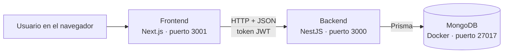

# Habit Tracker

Aplicación web para crear, seguir y analizar hábitos personales. Permite registrar hábitos con su frecuencia, prioridad y categoría, marcarlos como completados cada día y ver el progreso con rachas, estadísticas, gráficas y logros.

Proyecto individual. El repositorio tiene dos aplicaciones separadas: un **backend** (API REST) y un **frontend** (interfaz web).

## Funcionalidades

- **Cuenta de usuario:** registro, inicio y cierre de sesión con JWT. Las rutas de la app están protegidas.
- **Gestión de hábitos:** crear, editar, eliminar, activar y desactivar hábitos. Cada hábito tiene nombre, descripción, categoría, frecuencia (diaria, semanal o personalizada), prioridad, fecha de inicio y fecha de fin opcional. La lista se puede buscar, filtrar por estado y categoría y ordenar; por defecto muestra los hábitos activos, del más reciente al más antiguo. Desde cada hábito se marca el completado de hoy, y se puede desmarcar si se marcó por accidente.
- **Seguimiento:** historial de completados en vista diaria, semanal y mensual, con un calendario que muestra cuántos hábitos se completaron cada día de los que tocaban.
- **Dashboard:** hábitos activos, completados hoy, racha actual, mejor racha, porcentaje de cumplimiento, una gráfica de los últimos 7 días (completados contra los hábitos que tocaban cada día) y otra del último mes.
- **Estadísticas:** total de hábitos, activos, finalizados, racha actual, progreso de los últimos 30 días, tendencia semanal comparada con la semana anterior y el avance de cada hábito desde que empezó. Los hábitos finalizados se muestran aparte, medidos contra todo su periodo.
- **Perfil:** datos del usuario, edición del nombre, actividad personal (días en la app, veces completadas y hábito más constante) y logros desbloqueables.
- **Navegación adaptable:** menú lateral en escritorio, barra de navegación inferior en celular y menú de cuenta en el avatar de la barra superior.
- **Validaciones y errores:** formularios validados en el frontend (Zod) y en el backend (class-validator), con mensajes claros para el usuario.

### Cómo se calculan las métricas

- **Estado de un hábito:** cada hábito está en un solo estado. Es *finalizado* si su fecha de fin ya pasó; si no, es *activo* o *inactivo* según su interruptor. Por eso activos, finalizados e inactivos siempre suman el total.
- **Cumplimiento:** completados divididos entre los días en que el hábito tocaba. Un hábito semanal se cuenta como una vez por semana, y los días anteriores a la fecha de inicio o posteriores a la de fin no cuentan.
- **Avance por hábito:** se mide desde su fecha de inicio hasta hoy, o hasta su fecha de fin si ya terminó. Un hábito nuevo no sale castigado por los días en que todavía no existía.
- **Rachas:** la racha general cuenta los días seguidos en que se completó al menos un hábito. La racha de cada hábito se cuenta en días, salvo en los semanales, donde se cuenta en semanas seguidas.
- **Logros:** se calculan en el momento con los datos existentes (hábitos creados, mejor racha, veces completadas y semanas al 100%); no se guardan en la base de datos.

## Tecnologías

| Parte | Tecnología |
| --- | --- |
| Backend | NestJS 12, TypeScript |
| Base de datos | MongoDB (en Docker) con Prisma ORM 6 |
| Autenticación | JWT con Passport, contraseñas cifradas con bcrypt |
| Validación del backend | class-validator y class-transformer |
| Documentación de la API | Swagger (OpenAPI) |
| Pruebas | Jest |
| Frontend | Next.js 16 (App Router), React 19, TypeScript |
| Interfaz | Material UI 9 y MUI X Charts |
| Validación del frontend | Zod |

## Arquitectura

La aplicación está separada en frontend y backend. El frontend no se conecta a la base de datos: todo pasa por la API.



### Backend

Sigue la estructura modular de NestJS. Cada módulo tiene su controlador (rutas), su servicio (lógica) y sus DTO (validación de datos de entrada).

| Módulo | Responsabilidad |
| --- | --- |
| `auth` | Registro, inicio de sesión, emisión y validación del token JWT (vigencia de 7 días) |
| `users` | Consultar y editar el perfil del usuario autenticado |
| `habits` | CRUD de hábitos, activar/desactivar y registrar completados |
| `statistics` | Resumen, rachas, actividad, tendencia semanal y seguimiento por hábito |
| `prisma` | Conexión compartida a la base de datos |
| `config` | Validación de las variables de entorno al arrancar |

Todas las rutas, excepto registro e inicio de sesión, requieren el token JWT. Cada usuario solo puede ver y modificar sus propios hábitos.

### Modelo de datos

| Colección | Campos principales |
| --- | --- |
| `Usuario` | nombre, correo (único), contraseña cifrada, fecha de registro |
| `Habito` | nombre, descripción, categoría, frecuencia, prioridad, fecha de inicio, fecha de fin, activo, usuario |
| `Registro` | hábito, usuario, fecha, completado |

Un usuario tiene muchos hábitos, y cada hábito tiene un registro por cada día en que se completó.

### Frontend

Usa el App Router de Next.js. Las páginas de la app viven dentro de `src/app/(app)`, que comparte la barra superior, el menú lateral, la barra inferior de celular y la protección de sesión.

| Carpeta | Contenido |
| --- | --- |
| `src/app/login`, `src/app/register` | Inicio de sesión y registro |
| `src/app/(app)/dashboard` | Dashboard |
| `src/app/(app)/habitos` | Mis hábitos |
| `src/app/(app)/seguimiento` | Seguimiento diario, semanal y mensual |
| `src/app/(app)/estadisticas` | Estadísticas |
| `src/app/(app)/perfil` | Perfil |
| `src/components` | Componentes reutilizables: barra superior, menú lateral, barra inferior para celular, formulario de hábitos, vistas de seguimiento, lista de avance por hábito y logros |
| `src/lib` | Cliente de la API, esquemas de validación, tema de colores, sesión y utilidades de fechas |

## Requisitos

- [Node.js](https://nodejs.org) 20.9 o superior
- [Docker Desktop](https://www.docker.com/products/docker-desktop/)
- Git

## Instalación y ejecución

### 1. Clonar el repositorio

```bash
git clone https://github.com/Fhernandez20/ProyectoUx.git
cd ProyectoUx
```

### 2. Levantar MongoDB con Docker

En Docker Desktop, descarga la imagen oficial `mongo` y crea un contenedor con esta configuración:

| Opción | Valor |
| --- | --- |
| Nombre del contenedor | `nestjs-mongodb` |
| Puerto | `27017` → `27017` |
| `MONGO_INITDB_ROOT_USERNAME` | `admin` |
| `MONGO_INITDB_ROOT_PASSWORD` | `123456` |

O, desde la terminal, con un solo comando:

```bash
docker run -d --name nestjs-mongodb -p 27017:27017 -e MONGO_INITDB_ROOT_USERNAME=admin -e MONGO_INITDB_ROOT_PASSWORD=123456 mongo
```

El contenedor debe aparecer como **Running** en Docker Desktop.

### 3. Configurar y arrancar el backend

```bash
cd habit-tracker-backend
npm install
```

Copia `.env.example` como `.env`:

```bash
cp .env.example .env
```

En Windows (PowerShell) el comando equivalente es `Copy-Item .env.example .env`.

| Variable | Descripción |
| --- | --- |
| `DATABASE_URL` | Conexión a MongoDB. El valor del ejemplo ya coincide con el contenedor del paso 2. |
| `JWT_SECRET` | Clave para firmar los tokens. Cámbiala por una cadena larga y aleatoria. |
| `PORT` | Puerto del backend. Por defecto es `3000`. |
| `FRONTEND_URL` | Opcional. Origen permitido por CORS, por ejemplo `http://localhost:3001`. |

Genera el cliente de Prisma, sincroniza el esquema con la base y arranca el servidor:

```bash
npx prisma generate
npx prisma db push
npm run start:dev
```

El backend queda en `http://localhost:3000`.

### 4. Configurar y arrancar el frontend

En otra terminal, desde la raíz del repositorio:

```bash
cd habit-tracker-frontend
npm install
cp .env.example .env.local
npm run dev -- -p 3001
```

En `.env.local`, `NEXT_PUBLIC_API_URL` debe apuntar al backend (`http://localhost:3000`). Se usa el puerto 3001 porque el 3000 ya lo ocupa el backend.

Abre `http://localhost:3001`, crea una cuenta y empieza a registrar hábitos.

## Documentación de la API

Con el backend en ejecución, la documentación interactiva de Swagger está en:

```
http://localhost:3000/api
```

Para probar las rutas protegidas, usa `POST /auth/login`, copia el token y pégalo en el botón **Authorize**.

| Método | Ruta | Descripción |
| --- | --- | --- |
| POST | `/auth/register` | Crear una cuenta |
| POST | `/auth/login` | Iniciar sesión y obtener el token |
| GET | `/auth/me` | Datos del token actual |
| GET | `/users/me` | Perfil del usuario |
| PATCH | `/users/me` | Editar el nombre |
| GET | `/habits` | Listar hábitos |
| POST | `/habits` | Crear un hábito |
| GET | `/habits/completados-hoy` | Hábitos completados hoy |
| GET | `/habits/:id` | Ver un hábito |
| PATCH | `/habits/:id` | Editar un hábito |
| PATCH | `/habits/:id/toggle` | Activar o desactivar |
| POST | `/habits/:id/completar` | Marcar un hábito como completado hoy |
| DELETE | `/habits/:id/completar` | Desmarcar el completado de hoy |
| GET | `/habits/:id/registros` | Historial de un hábito |
| DELETE | `/habits/:id` | Eliminar un hábito |
| GET | `/statistics/resumen` | Totales por estado, rachas, porcentajes y veces completadas |
| GET | `/statistics/actividad` | Completados y hábitos que tocaban cada día |
| GET | `/statistics/tendencia` | Porcentaje por semana (bloques de 7 días hasta hoy) |
| GET | `/statistics/seguimiento` | Datos para las vistas de seguimiento |
| GET | `/statistics/habitos` | Avance de cada hábito desde su inicio, rachas y periodo |


## Autor

Fernando Hernández
